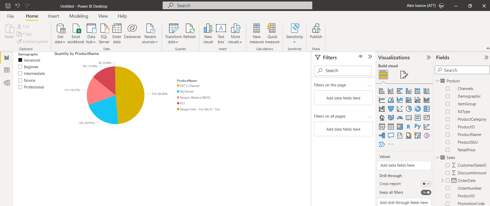
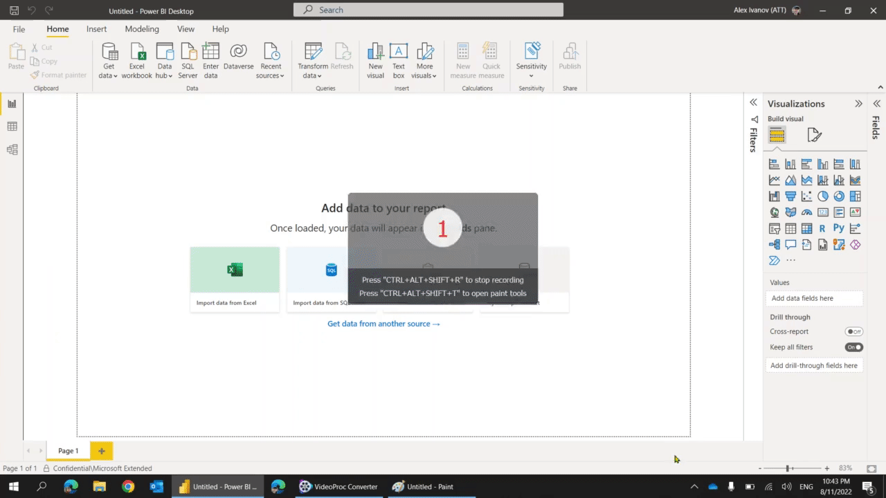
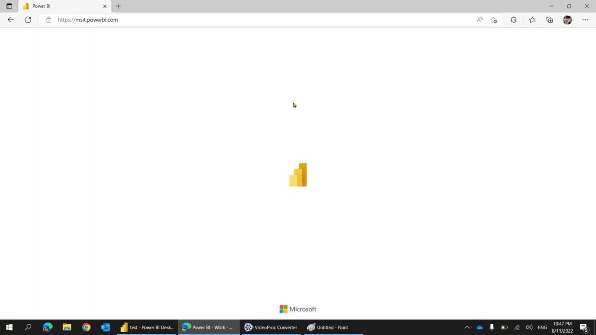

# PL-300. Module #1. Demo #1: Power BI Reports

In the demo, the new PBI report will be created from scratch and published to the PBI portal. All steps of loading data, modeling and building visualization will be explained without details. 

## Technical Requirements

- MS SQL Server with TailSpintoys [database](https://github.com/MicrosoftLearning/PL-300-Microsoft-Power-BI-Data-Analyst/tree/Main/Allfiles/DatabaseBackup)
- PBI Desktop installed
- Access to PBI Portal

## Demonstration

1. Create new PBI report in PBI Desktop

1. Load `Sales` and `Products` tables

1. On the report create slicer pointed to `Products.Demographic` and pie chart with `Products.ProductName` and `Sales.Quantity`. The report visualization should looks like following:

    

1. Report file [demo-report.pbix](demo-report.pbix)

1. Publish report to the PBI portal and observer the report from portal. The modification for visuals like adding another page and another chart available also from portal.

## Recoding
- Build report from the PBI Desktop
    

- Modifiy report from the PBI Portal.
    